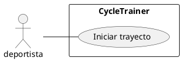

# CU001 : Iniciar Trayecto

---

**Descripción:**  Cuando un deportista va a iniciar un trayecto en bicicleta, registra el inicio de trayecto indicando la longitud y la latitud de la ubicación actual

**Actor:** Deportista

## Flujo de Eventos (Guión)

| Actor  | Sistema |
|:-------|:---------|
| 1. Ingresa la longitud y la latitud de la ubicación actual | |
| | 2. Verifica que no exista otro trayecto activo ||
| | 3. Determina fecha y hora |
| | 4. Determina un id para un nuevo trayecto |
| | 5. Almacena un nuevo trayecto con el id, fecha y hora de inicio |
| | 6. Agrega una ubicación con la longitud y latitud de ubicación inicial a la trayectoria |
| | 7. Retorna el id del nuevo trayecto |

## Excepciones

2. Cuando ya existe un trayecto activo

| Actor  | Sistema |
|:-------|:---------|
| | 2.1. Muestra un mensaje "No se puede iniciar otro trayecto mientras se tiene un trayecto activo" |
| | 2.2. Termina | 

