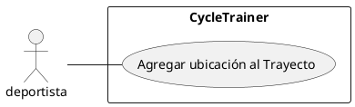

# CU002 : Agregar ubicación al Trayecto
---

**Descripción:**  Cuando un deportista avanza en su trayecto en bicicleta, registra cada cinco minutos la longitud y la latitud de la ubicación actual como parte del trayecto actual.

**Actor:** Deportista

## Flujo de Eventos (Guión)

| Actor  | Sistema |
|--------|---------|
| 1. Ingresa el id del trayecto en curso ||
| | 2. verifica que exista un trayecto con ese id |
| | 3. verifica que el trayecto esté activo |
| 4. Ingresa la longitud y la latitud de la ubicación actual | |
| | 5. Determina fecha y hora |
| | 6. Agrega  una nueva ubicación con fecha y hora actual y la longitud y latitud de la ubicación al trayecto en curso |

## Excepciones

2. Cuando no existe un trayecto con ese id

3. Cuando el trayecto seleccionado no está activo
