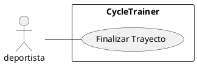

# CU003 - Finalizar Trayecto
---

**Descripción:**  Cuando un deportista termina su trayecto en bicicleta, registra la longitud y la latitud de la ubicación actual como punto final del trayecto actual.

**Actor:** Deportista

## Flujo de Eventos (Guión)

| Actor  | Sistema |
|--------|---------|
| 1. Ingresa el id del trayecto en curso ||
| | 2. verifica que exista un trayecto con ese id |
| | 3. verifica que el trayecto esté activo |
| 4. Ingresa la longitud y la latitud de la ubicación actual | |
| | 5. Determina fecha y hora |
| | 6. Agrega  una nueva ubicación con fecha y hora actual y la longitud y latitud de la ubicación al trayecto en curso |
| | 7. Calcula la duración del trayecto |
| | 8. Actualiza el trayecto grabando la hora final del trayecto, la duración y cambiando el estado a inactivo |

## Excepciones

2. Cuando no existe un trayecto con ese id

| Actor  | Sistema |
|:-------|:---------|
| | 2.1. Muestra un mensaje "No se existe el trayecto al que se desea agregar la ubicación" |
| | 2.2. Termina | 

3. Cuando el trayecto no está activo 

| Actor  | Sistema |
|:-------|:---------|
| | 2.1. Muestra un mensaje "No se puede agregar una ubicación a un trayecto no activo" |
| | 2.2. Termina | 