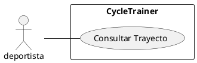

# CU004 - Consultar estadísticas del trayecto
---

**Descripción:**  Cuando un deportista termina un trayecto o cuando desea ver la información de un trayecto que acaba de terminar, solicita la información de ese trayecto.

**Actor:** Deportista

## Flujo de Eventos (Guión)

| Actor  | Sistema |
|--------|---------|
| 1. Ingresa el id del trayecto a revisar ||
| | 2. verifica que exista un trayecto con ese id |
| | 3. Muestra la información de la hora de inicio, la longitud y latitud de la ubicación inicial, la longitud y latitud de todas las ubicaciones de ese trayecto, la distancia recorrida, la hora final y la longitud y latitud de la última ubicación |

## Excepciones

2. Cuando no existe un trayecto con ese id

| Actor  | Sistema |
|:-------|:---------|
| | 2.1. Muestra un mensaje "No se existe el trayecto que se desea finalizar" |
| | 2.2. Termina | 