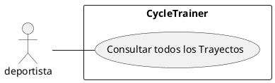

# CU005- Consultar resumen de todos los trayectos
---

**Descripción:**  Cuando un deportista desea revsiar todos los trayectos que ha hecho, solicita la información de los trayectos en un período de tiempo.

**Actor:** Deportista

## Flujo de Eventos (Guión)

| Actor  | Sistema |
|--------|---------|
| 1. Ingresa la fecha de inicio y la fecha fin de los trayectos a consultar  ||
| | 2. Verifica que la fecha de inicio sea menor que la fecha final |
| | 3. Verifica que la fecha final sea menor o igual a la fecha actual |
| | 4. Obtiene todos los trayectos en ese rango de fechas |
| | 5. Muestra la información todos los trayectos encontrados: la hora de inicio, la longitud y latitud de la ubicación inicial, la longitud y latitud de todas las ubicaciones de ese trayecto, la distancia recorrida, la hora final y la longitud y latitud de la última ubicación |

## Excepciones

2. Cuando la fecha de inicio es mayor que la fecha final

| Actor  | Sistema |
|:-------|:---------|
| | 2.1. Muestra un mensaje "La fecha de inicio debe ser menor a la fecha final" |
| | 2.2. Termina | 

3. Cuando la fecha final es mayor que la fecha actual

| Actor  | Sistema |
|:-------|:---------|
| | 3.1. Muestra un mensaje "La fecha final no puede ser mayor a la fecha actual" |
| | 3.2. Termina | 
