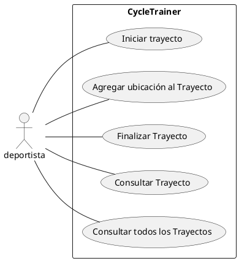

# Casos de Uso

---

* [CU001 - Iniciar Trayecto](CU001-iniciar-trayecto.md)
* [CU002 - Registrar ubicación durante un trayecto](CU002-registrar-ubicacion.md)
* [CU003 - Finalizar Trayecto](CU003-finalizar-trayecto.md)
* [CU004 - Consultar estadísticas del trayecto](CU004-consultar-trayecto.md)
* [CU005- Consultar resumen de todos los trayectos](CU005-consultar-resumen-trayectos.md)